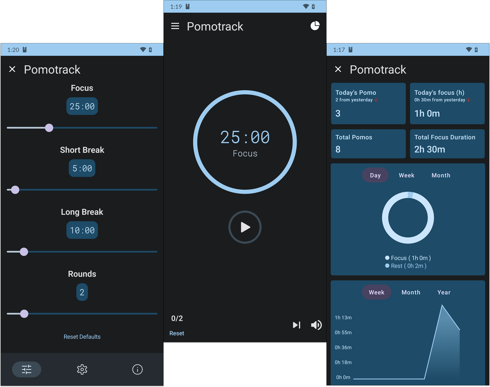

<div align="center">
  
</div>

<div align="center">
  
</div>

<div align="center">
  
</div>

<p align="center">Simple and visually-pleasing Pomodoro timer.</p>

# **Pomotrack**

### **PomoTrack** is a pomodoro that tracks all your timers and shows it in graphs with jetpack compose and clean architecture

This project is developed by **jaskq** for more projects [GitHub](https://github.com/jackq97/) .

## Application Install

***You can Install and test latest DashCoin app from below 👇***

[](https://github.com/MathRoda/Dash-Coin-App/releases/download/v1.1.0/DashCoin.apk)

or from the IzzyOnDroid F-Droid compatible repo

[](https://apt.izzysoft.de/fdroid/index/apk/com.mathroda.dashcoin)

## About

- Clean and Simple UI with Jetpack Compose Material dynamic theme.
- Best and Clean Code Quality following Modern Android Development

### Technical details

- Pomotrack is made using Kotlin & Jetpack Compose and following Modern Android Development
  practices.
- Pomotrack uses Room to store users focus and rest 
- Pomotrack uses jetpack datastore to save user preferences and settings
- Pomotrack uses Kotlin Coroutines and Flow to handle all asynchronous tasks.
- Pomotrack uses all Jetpack libraries and follows clean architecture.

## Built With 🛠

- [Kotlin](https://kotlinlang.org/) - First class and official programming language for Android
  development.
- [Jetpack Compose](https://developer.android.com/jetpack/compose) - Jetpack Compose is Android’s
  modern toolkit for building native UI
- [Coroutines](https://kotlinlang.org/docs/reference/coroutines-overview.html) - For asynchronous
  and more..
- [Flow](https://kotlin.github.io/kotlinx.coroutines/kotlinx-coroutines-core/kotlinx.coroutines.flow/-flow/)
    - A cold asynchronous data stream that sequentially emits values and completes normally or with
      an exception.
- [StateFlow](https://developer.android.com/kotlin/flow/stateflow-and-sharedflow) - StateFlow is a
  state-holder observable flow that emits the current and new state updates to its collectors.
- [Android Architecture Components](https://developer.android.com/topic/libraries/architecture) -
  Collection of libraries that help you design robust, testable, and maintainable apps.
    - [ViewModel](https://developer.android.com/topic/libraries/architecture/viewmodel) - Stores
      UI-related data that isn't destroyed on UI changes.
- [Dependency Injection](https://developer.android.com/training/dependency-injection) -
    - [Hilt-Dagger](https://dagger.dev/hilt/) - Standard library to incorporate Dagger dependency
      injection into an Android application.
    - [Hilt-ViewModel](https://developer.android.com/training/dependency-injection/hilt-jetpack) -
      DI for injecting `ViewModel`.
- [Room](https://developer.android.com/jetpack/androidx/releases/room) - an abstraction layer over
  SQLite to allow for more robust database access while harnessing the full power of SQLite.
- [Lottie](https://lottiefiles.com) A Lottie is a JSON-based animation file format that enables
- [Material Components for Android](https://github.com/material-components/material-components-android)
    - Modular and customizable Material Design UI components for Android.

## Contact

you can connect with me here [LinkedIn](https://www.linkedin.com/in/mathroda/) .

# License

```xml
Copyright 2023 Jaskq, Inc. All Rights Reserved.

Licensed under the Apache License, Version 2.0 (the "License");
you may not use this file except in compliance with the License.
You may obtain a copy of the License at

   http://www.apache.org/licenses/LICENSE-2.0

Unless required by applicable law or agreed to in writing, software
distributed under the License is distributed on an "AS IS" BASIS,
WITHOUT WARRANTIES OR CONDITIONS OF ANY KIND, either express or implied.
See the License for the specific language governing permissions and
limitations under the License.
```